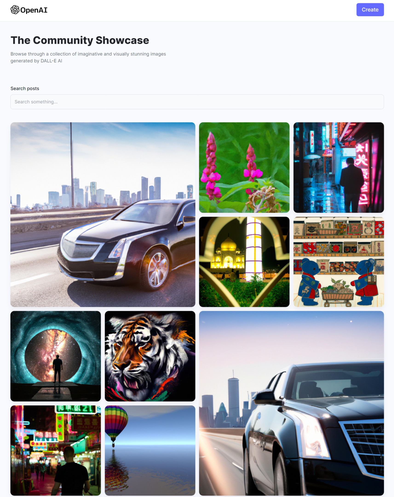
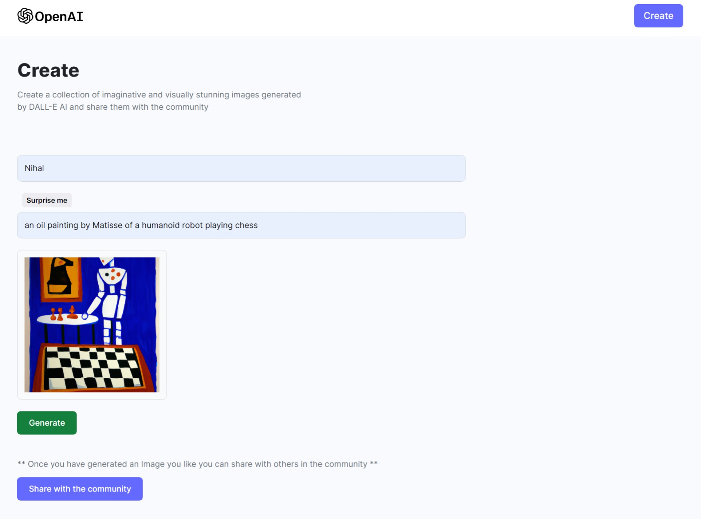

# AI-Artisan

[Live Website](https://ai-artisannihal.netlify.app/)

### Description 
This project is a MERN stack web application that utilizes OpenAI's Dall-E model to generate AI images based on user text prompts. The app will have a modern and minimal design, with a dynamic image layout. The user will be able to input text prompts and the app will generate AI images based on the text. The user will also be able to customize the image layout, allowing them to create unique and creative images. The app will also feature a gallery of AI images created by other users, allowing users to explore and discover new images. The app will also feature a search function, allowing users to quickly find images based on keywords.

### Screenshots

## Home

This is the home page which is having all the images shared by the users to the community.

## Create Post 

This is the Create post page, where the user an enter prompt and can generate image and also can share it to the community.

### Installation
Cloudinary
CORS
OpenAI
MongoDB/Mongoose
Express.js
Node.js

### Tech-Stacks
OpenAI - Dall-E Model,
Cloudinary,
MongoDB
React,
Tailwind CSS,
HTML5,
Vite
